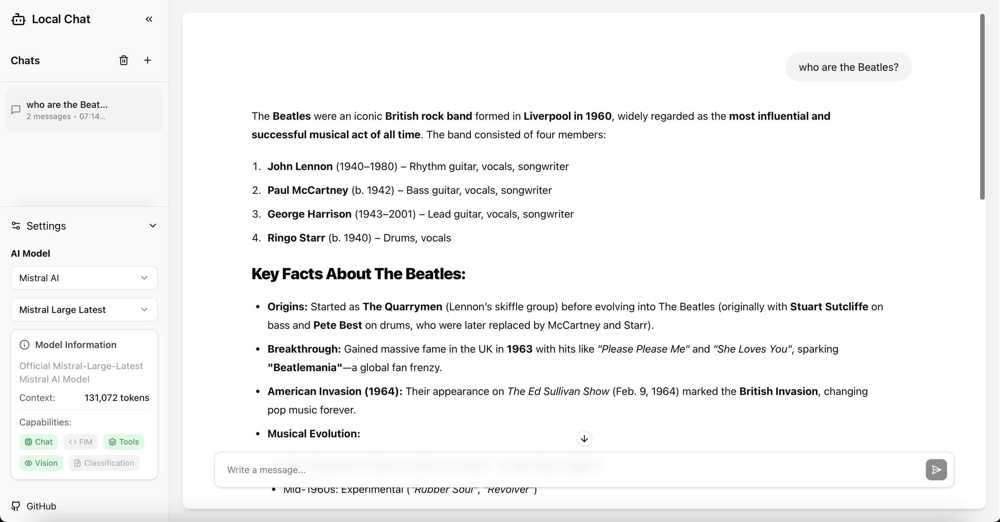

# Local Chat APP

A full-stack chat application built with Next.js, FastAPI, and PostgreSQL. Features conversation history storage and integration with Mistral AI models.

**Built for Mistral AI SWE internship application.**



## Features

- Chat history stored in PostgreSQL
- Integration with Mistral AI API
- Thread-based conversation management
- Modern UI with Next.js and assistant-ui
- Streaming responses

## Architecture

- **Backend**: FastAPI with SQLAlchemy ORM
- **Frontend**: Next.js 15 with React 19 and assistant-ui
- **Database**: PostgreSQL 17
- **AI Integration**: Mistral AI API

## Prerequisites

- Python 3.8+
- Node.js 18+ (via any version manager: nvm, volta, fnm, asdf, or system install)
- Docker and Docker Compose
- pnpm (auto-installed if missing)
- Mistral AI API key

## Quick Setup

### Automated Setup

```bash
# Run setup script
./setup.sh

# Edit backend/.env with your API keys
# DATABASE_URL is pre-configured for the Docker PostgreSQL instance

# Start all services (PostgreSQL, Backend, Frontend)
./start-dev.sh
```

The application will be available at:

- Frontend: http://localhost:3000
- Backend API: http://localhost:8000
- PostgreSQL: localhost:5432

### Manual Setup

**Backend:**

```bash
cd backend
python3 -m venv venv
source venv/bin/activate
pip install -r requirements.txt
cp .env.example .env
# Edit .env with your configuration
```

**Frontend:**

```bash
cd frontend
pnpm install
```

**Database:**

```bash
docker-compose up -d
```

**Run servers:**

```bash
# Terminal 1 - Backend
cd backend
source venv/bin/activate
uvicorn main:app --reload --host 0.0.0.0 --port 8000

# Terminal 2 - Frontend
cd frontend
pnpm dev
```
